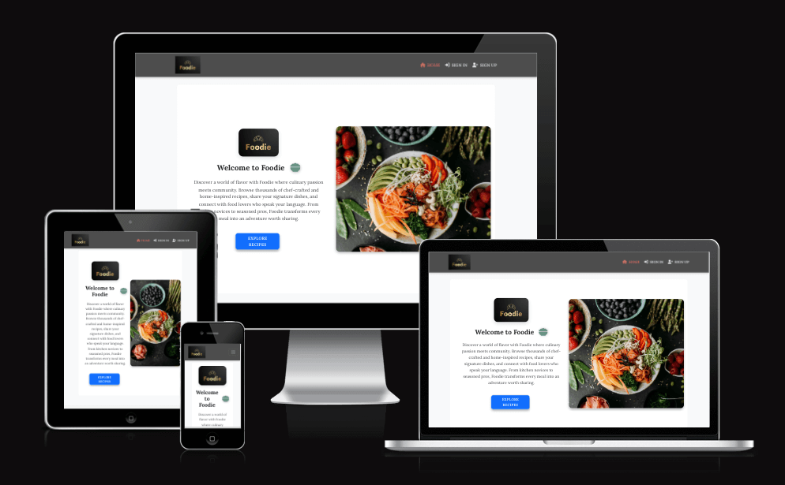

# 🍽 Foody Frontend

[](https://github.com/Mustafa-Vienna/foodie/commits/main)
[](https://github.com/Mustafa-Vienna/foodie/commits/main)
[](https://github.com/Mustafa-Vienna/foodie)


---

## 📖 Contents <a id="contents"></a>

1. [Project Overview](#project-overview)
2. [Related Projects](#related-projects)
3. [Project Structure](#project-structure)
4. [Features](#features)
   - [Current Features](#current-features)
   - [Upcoming Features](#upcoming-features)
5. [UX and UI Design](#ux-and-ui-design)
   - [Colour Scheme](#colour-scheme)
   - [Typography](#typography)
   - [Wireframes](#wireframes)
6. [Technologies Used](#technologies-used)
7. [Agile Workflow](#agile-workflow)
   - [GitHub Projects](#github-projects)
   - [GitHub Issues](#github-issues)
   - [MoSCoW Prioritization](#moscow-prioritization)
8. [Testing](#testing)
9. [Deployment](#deployment)
   - [Live Site](#live-site)
   - [Local Setup](#local-setup)
10. [Known Issues and Future Enhancements](#known-issues-and-future-enhancements)
11. [Credits](#credits)

---

## 🌟 Project Overview <a id="project-overview"></a>

**Foodie** is a full-featured **React frontend** for a modern recipe-sharing platform. It enables food lovers to explore, publish, and engage with recipes through a clean, interactive, and socially driven interface. The frontend communicates with a RESTful API built using Django and secured with JWT authentication, supporting full CRUD operations, user feedback (likes & comments), and personalized user profiles.

The interface is fully responsive and optimized for seamless use across all devices — mobile, tablet, and desktop.



[Go to Contents](#contents)


---

## 🌐 Related Projects <a id="related-projects"></a>

### 💻 Frontend Application (React)
- 🔗 GitHub: [Mustafa-Vienna/foodie](https://github.com/Mustafa-Vienna/foodie)
- 🚀 Live Demo: [https://foodiefront-bacd5250c6d8.herokuapp.com/](https://foodiefront-bacd5250c6d8.herokuapp.com/)

### 🧠 Backend API (Django REST + JWT)
- 🔗 GitHub: [Mustafa-Vienna/foodie-back](https://github.com/Mustafa-Vienna/foodie-back)
- 🚀 Live API: [https://foodieback-0e50528a3736.herokuapp.com/](https://foodieback-0e50528a3736.herokuapp.com/)

[Go to Contents](#contents)


## 🧱 Project Structure <a id="project-structure"></a>

The frontend of Foody is structured using a component-based architecture in React. Pages, components, styles, and context are modularly separated to ensure scalability, clarity, and maintainability.

More details on individual folders and file roles are outlined below.

[Go to Contents](#contents)

---

## ✨ Features <a id="features"></a>

Foody offers a dynamic, user-friendly recipe-sharing experience. Users can sign up, create posts with images, like others’ posts, and leave comments. The interface is responsive and intuitive, with personalized content for logged-in users.

### ✅ Current Features <a id="current-features"></a>

- **User Authentication**  
  - Sign up, sign in, and sign out functionality using JWT tokens.

- **Post Management**  
  - Users can create, update, and delete posts.
  - Posts include images, tags, timestamps, and view counters.
  - Users can like and unlike posts.

- **Comments Section**  
  - Logged-in users can add, edit, and delete comments under each post.
  - Each comment displays the author, timestamp, and is tied to its post.

- **Liked Posts Page**  
  - Users can view a dedicated page listing all posts they've liked.
  - Unliking a post removes it from the list dynamically.

- **User Profile Page**  
  - Each user has a profile page displaying their posts and profile image.
  - Users can update their profile information and avatar.

- **Infinite Scroll**  
  - Posts load dynamically as the user scrolls, improving performance and user experience.

- **Responsive Layout**  
  - Fully responsive design using Bootstrap 5.3.3 and modular CSS for layout and styling.

- **Reusable Components**  
  - Core components like `NavBar`, `PostCard`, `LikeButton`, `CommentList`, and `LoadMoreButton` are used across multiple pages to maintain consistency.

---

### 🔮 Upcoming Features <a id="upcoming-features"></a>

Several advanced features are planned for future updates. Many are already supported by the backend and will be integrated into the frontend to enhance interactivity and personalization:

- **Follow System Integration**  
  Display followed users’ posts in a personalized activity feed to build community interaction.

- **Draft Post Feature**  
  Allow users to save posts as drafts and publish them later.

- **Tag-Based Filtering**  
  Implement tag filters such as **Fresh**, **Hot**, and **Featured**, using dynamic backend logic based on post activity.

- **Search Functionality**  
  Let users search posts by title, tags, or author for easier content discovery.

- **Dark Mode Toggle**  
  Provide a toggle to switch between light and dark themes.

- **Custom Error Pages**  
  Add user-friendly 404 and general error pages for improved navigation and experience.

- **Popular Posts Section**  
  Highlight posts with high engagement (e.g., most likes and comments) in a dedicated section to showcase trending content.


[Go to Contents](#contents)


---

## 🎨 UX and UI Design <a id="ux-and-ui-design"></a>

Foody's UI is designed to be clean, modern, and fully responsive across all devices. The interface prioritizes usability, accessibility, and consistency across pages using Bootstrap 5.3.3 and modular CSS.

Styling is managed through:
- `SharedStyles.module.css` – shared spacing, layout, and color variables.
- Individual `.module.css` files – scoped styles for specific components.

### 🎨 Colour Scheme <a id="colour-scheme"></a>

The color palette uses soft, accessible tones to create a welcoming environment. High-contrast text ensures readability, while accent colors highlight interactive elements like buttons, links, and icons.

| Element           | Styling Source                  |
|-------------------|---------------------------------|
| Background        | `sharedStyles.pageContainer`    |
| Accent Elements   | `--accent-color` (custom var)   |
| Primary Text      | `--text-primary` (custom var)   |
| Buttons & Links   | Bootstrap + CSS module classes  |

> Color variables are defined and reused via `SharedStyles.module.css` to ensure visual consistency.

### 🔠 Typography <a id="typography"></a>

- **Primary Font**: `Roboto` – clean and readable for body content.
- **Secondary Font**: `Open Sans` – used for small labels, hints, and light UI elements.
- Fonts are imported globally in `index.css` and used with Bootstrap utilities and module-specific classes.

Font sizes, spacing, and hierarchy are optimized for readability across all screen sizes.

[Go to Contents](#contents)

---

## 🛠 Technologies Used <a id="technologies-used"></a>

### 📦 Languages & Frameworks

- [](https://reactjs.org/) used as the main JavaScript library for building the UI.
- [](https://reactrouter.com/) used for client-side routing.
- [](https://getbootstrap.com/) used for responsive layouts and utility classes.
- [](https://react-bootstrap.github.io/) used for Bootstrap components as React elements.
- [](https://github.com/css-modules/css-modules) used for writing modular and scoped CSS styles.
- [](https://styled-components.com/) used for component-level dynamic styling using JavaScript.

### 🔗 API & Data Handling

- [](https://axios-http.com/) used to send asynchronous requests to the backend API.
- [](https://www.django-rest-framework.org/) used to serve the API (backend repo linked in Related Projects).

### ⚙️ Utilities & Interactions

- [](https://www.npmjs.com/package/react-infinite-scroll-component) used for loading more content as the user scrolls.
- [](https://date-fns.org/) used to format and handle timestamps.

### 🧰 Development Tools

- [](https://eslint.org/) used to maintain code quality.
- [](https://prettier.io/) used to format code consistently.
- [](https://web.dev/vitals/) used to measure performance and UX.
- [](https://create-react-app.dev/docs/getting-started/) used as the base setup for bootstrapping the project.

[Go to Contents](#contents)

---

## 🧪 Agile Workflow <a id="agile-workflow"></a>

This project followed an **Agile-inspired** approach using **GitHub Projects** and **Issues** for managing tasks, features, and bugs during the frontend development phase.

### 📋 GitHub Projects <a id="github-projects"></a>

A **Kanban-style board** was used to track progress, with columns structured as:

1. **To Do** – Features and enhancements planned for development  
2. **In Progress** – Currently active development tasks  
3. **Done** – Fully implemented, tested, and reviewed items

You can view the project board here:  
🔗 [GitHub Project Board](https://github.com/users/Mustafa-Vienna/projects/7)

---

### 🐛 GitHub Issues <a id="github-issues"></a>

Each major task or feature was tracked via GitHub Issues, with clear and descriptive titles. Instead of traditional labels like `bug` or `enhancement`, I used the MoSCoW prioritization method to categorize issues as `Must-Have`, `Should-Have`, `Could-Have`, or `Won’t-Have`.

This ensured transparent prioritization and alignment with project goals. All relevant commits were linked directly to these issues, enabling efficient tracking of development progress.

---

### 🔄 MoSCoW Prioritization <a id="moscow-prioritization"></a>

I used the **MoSCoW method** to prioritize features during planning and sprint retrospectives:

- **Must Have**: User authentication, post creation, commenting, profile views  
- **Should Have**: Liked posts page, reusable components, infinite scroll  
- **Could Have**: Search bar, dark mode, tag filters  
- **Won’t Have (for now)**: Messaging, post pinning, advanced notifications

---

### 📝 Note on Agile Planning and User Stories

While this project followed an **Agile-inspired** methodology, the **user stories** and **Kanban board** were formally structured **at the end** of the development cycle.

In the early stages, my focus was fully on backend development. I followed the Code Institute’s Django REST Framework tutorial to build a secure, functional API that could support future frontend integration.

Once the backend was complete and tested, I moved on to developing the frontend. This phase came with its own challenges, especially due to **modern React library dependencies** and **limited source**. I spent significant time troubleshooting breaking changes, adjusting configurations, and ensuring everything worked smoothly with the backend.

As the project deadline approached, I retrospectively wrote detailed **user stories** based on the actual features implemented. I created them directly in GitHub Issues and added them to the Kanban board to reflect real progress.

Due to time constraints, all tickets were created and marked **“Done”** on the same day. This ensured accurate documentation of work while maintaining transparency and alignment with Agile principles — even if applied retrospectively.

This approach allowed me to clearly communicate what was achieved, what’s pending, and how the workflow evolved throughout the project.

[Go to Contents](#contents)

--

## ✅ Testing <a id="testing"></a>

The Foody frontend was manually and visually tested across various browsers, screen sizes, and usage scenarios to ensure consistent performance, functionality, and responsiveness. Each component and user interaction was carefully validated based on user stories and real-world expectations.

### 🔍 Manual Testing

- All pages were manually tested to verify layout, styling, and responsiveness.
- Buttons, forms, and interactive elements were tested for proper functionality and feedback.
- Navigation between routes (e.g., Home, Feed, Post Detail, Liked, Profile, Sign In/Up) was confirmed using both the navigation bar and direct links.
- API interactions (like post creation, liking, commenting) were tested via live backend integration.
- Responsive behavior was tested on Chrome Developer Tools (mobile, tablet, and desktop breakpoints).

### 🧪 Browser Compatibility

Tested successfully on:

- Chrome (desktop & mobile)
- Firefox
- Safari
- Edge

### 🧑‍💻 Component Testing

Although unit testing libraries were not implemented due to time constraints, each major React component (e.g., `PostCard`, `NavBar`, `PostCreateForm`, `LikeButton`, `CommentList`) was manually tested within the application through interaction, edge cases, and error states (e.g., empty form submissions, no internet connection).

### ⚠️ Known Limitations

- Form validation relies on backend responses and minimal frontend checks.

> Full testing documentation including specific user stories and testing scenarios is available in the [TESTING.md](TESTING.md) file.

[Go to Contents](#contents)


---

## 🚀 Deployment <a id="deployment"></a>

The Foodie frontend is deployed on **Heroku** using a GitHub-connected pipeline for automatic deployment.

### 🌐 Live Site <a id="live-site"></a>

- 🔗 **Frontend**: [https://foodiefront-bacd5250c6d8.herokuapp.com/](https://foodiefront-bacd5250c6d8.herokuapp.com/)
- 🔗 **Backend**: [https://foodieback-0e50528a3736.herokuapp.com/](https://foodieback-0e50528a3736.herokuapp.com/)

### 🛠 Local Setup <a id="local-setup"></a>

To run the project locally:

1. **Clone the repository**

```bash
git clone https://github.com/Mustafa-Vienna/foodie.git
cd foodie
```

2. **Install dependencies**

```bash
npm install
```

3. **Start the development server**

```bash
npm start
```

- *The app should now be running at:*
`http://localhost:3000/`

---

### ⚙️ Environment Setup <a id="environment-setup"></a>

- Ensure the **backend (Django API)** is running locally or already deployed.

- If you're using a local backend, update the API base URL in the axios config file:

  `src/api/axiosDefault.js`


> ⚠️ **Note**: Make sure your backend has the correct **CORS settings** configured to allow communication with the frontend.


## 🔧 Known Issues and Future Enhancements <a id="known-issues-and-future-enhancements"></a>

### 🌱 Future Features

- **Edit/Delete Posts**  
  Enable users to manage their posts after publishing.

- **Edit/Delete Comments**  
  Allow users to modify or remove their own comments.

- **Follow/Unfollow Users**  
  Let users follow others to build a personalized recipe feed.

- **Draft Post Feature**  
  Allow users to save draft posts for later editing or publishing.

- **Profile Editing**  
  Users can update their profile image and display name.

- **Tag Filters (e.g., Popular, Fresh)**  
  Add tag-based filters to help users explore content more easily.

- **Popular Posts**  
  Introduce a dedicated section or filter to highlight the most liked or engaged posts.

- **Dark Mode Toggle**  
  Add an option to switch between light and dark themes.

- **Search Functionality**  
  Let users search for posts using keywords, tags, or authors.

- **Followed Feed View**  
  Show a feed with posts from followed users only.

---

### ⚠️ Known Issues

- **Manual Tag Assignment**  
  Tags like *Hot*, *Fresh*, and *Future* are currently assigned manually. A future update will implement automated logic based on views, timestamps, and interactions.

- **Retrospective Agile Planning**  
  The Agile board and user stories were documented after development due to time constraints. All completed tasks were moved directly to the **Done** column for transparency.

- **Basic 404 Handling (Improved)**  
  While a simple "Post not found or an error occurred" message is currently shown for invalid post URLs, a fully customized 404 page is still planned as a visual enhancement.

- **Profile Image Refresh Issue**  
  When a user updates their profile image, the new image does not display immediately. The update only appears after the user logs out and logs back in. Until then, the avatar still shows the old image.

[Go to Contents](#contents)

---

## 🧠 Credits <a id="credits"></a>

### 📚 Resources Used

- **[Code Institute LMS](https://codeinstitute.net/)**  
  For providing the foundational full-stack course and structured roadmap for this final milestone project.

- **Udemy Course by Maximilian Schwarzmüller**  
  _React - The Complete Guide (incl Hooks, React Router, Redux)_  
  Helped deepen my understanding of modern React (18+), component architecture, and state management.

- **YouTube - JavaScript Mastery**  
  Their modern React tutorials helped me stay current with new patterns (e.g., modular CSS, React Router DOM v6+).

- **Stack Overflow**  
  Used frequently for debugging React-specific issues, authentication logic, image refreshing, and Axios error handling.

- **React Docs + Bootstrap Docs**  
  The official documentation helped clarify usage differences, especially when combining `react-bootstrap` with native Bootstrap 5.3.3 classes.

---

### 💡 Code Used

- **GitHub Inspiration**  
  Elements of this README's structure were inspired by my previous project (Pet Adoption) and Ibrahim’s project (_BSC Hastedt Football Camp_), particularly the clean breakdown of technologies and the use of shields/badges for visual clarity.

- **Stack Overflow Snippet**  
  The refresh issue related to updated profile images was addressed by referencing several Stack Overflow threads regarding React state/cache refresh after PUT requests.

- **404 Page Handling Logic**  
  Basic error message handling for the Post Detail page was inspired by common patterns in React router error fallback design.

---

### 🙌 Acknowledgements

- **Ioan** – Classmate  
  A huge thank you to Ioan for his consistent support and programming insights throughout the project. He helped me modularize components, reason through edge cases, and improve the overall maintainability of the frontend logic.

- **Dejan** – Senior Frontend Developer (Colleague)  
  Dejan’s frontend expertise was invaluable. He reviewed complex UI interactions, suggested improvements to the responsive design, and helped me optimize my use of CSS modules and shared styles.

- **Mihai** – Senior Backend Engineer (Colleague)  
  Mihai provided technical guidance on backend integration and helped debug JWT-related issues and API response handling. His feedback improved both error handling and performance.

- **Mentor Luke** – Code Institute  
  Many thanks to Luke for his mentorship throughout the project. His feedback helped sharpen my deployment strategy, GitHub usage, and general project structure. His guidance ensured the final result was polished and complete.

- **ChatGPT**  
  My virtual sidekick throughout this journey. Helped me understand tough errors and refine documentation — especially this README file.

[Go to Contents](#contents)
