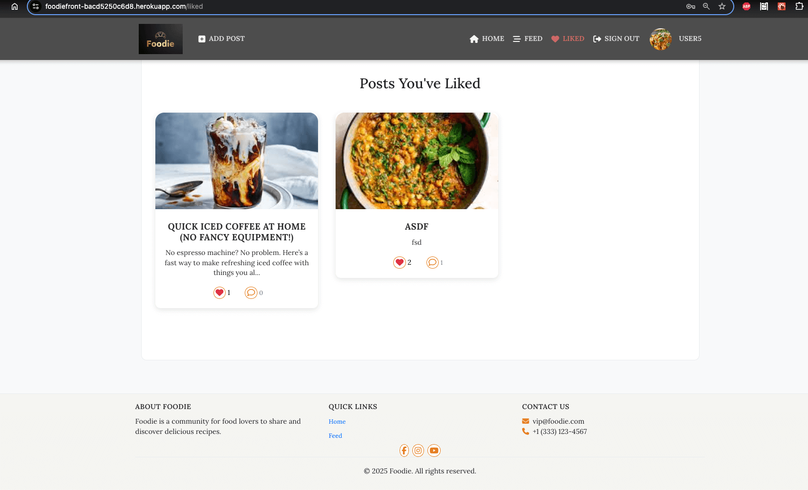

# 🧪 Foody - Testing Report

> [!NOTE]  
> Return back to the [README.md](README.md) file.

---

## 📋 Contents

1. [Manual Testing](#manual-testing)
   - [Authentication](#authentication)
   - [Navbar / Footer](#navbar--footer)
   - [Create / Edit Post](#create--edit-post)
   - [Like & Comment](#like--comment)
   - [User Profile](#user-profile)
   - [Liked Page](#liked-page)
   - [Preview Page](#preview-page)
   - [Navigation Tests](#navigation-tests)
2. [Browser Compatibility](#browser-compatibility)
3. [Responsiveness](#responsiveness)
4. [Device Testing](#device-testing)
5. [Lighthouse Testing](#lighthouse-testing)
6. [Known Bugs](#known-bugs)
7. [Unfixed Bugs](#unfixed-bugs)

---

## ✅ Manual Testing

### Authentication

#### US01: As a new user, I can register to access the platform.

| Test ID     | Test Scenario                   | Steps                                                              | Expected Result                                              | Status   | Image |
|-------------|----------------------------------|--------------------------------------------------------------------|--------------------------------------------------------------|----------|--------|
| US01-TS01   | Registration form is accessible  | Navigate to the `/signup` page                                     | Form with username, email, and password fields is displayed  | ✅ Pass  |  |
| US01-TS02   | Register with valid input        | Fill in valid username, email, password, confirm password → Submit | User is registered, redirected to homepage, auto-logged in   | ✅ Pass |  |
| US01-TS03   | Password mismatch validation     | Enter mismatching passwords and click "Sign Up"                    | Error: "Passwords do not match!" shown below the fields      | ✅ Pass  |  |
| US01-TS04   | Empty fields validation          | Leave all required fields empty and submit                         | Error messages displayed for each missing field              | ✅ Pass  |  |
| US01-TS05   | Password strength check          | Enter a password with less than 6 characters (e.g., `12345`)       | Error: "Password must be at least 6 characters long!"        | ✅ Pass  |  |
| US01-TS06   | Form interaction hover feedback  | Hover over fields and the Sign Up button                           | Input and button highlight feedback on hover is visible      | ✅ Pass  |  |

---

#### US02: As a user, I can log in to use the app.

| Test ID     | Test Scenario                   | Steps                                                                 | Expected Result                                           | Status  | Image | Comment |
|-------------|----------------------------------|-----------------------------------------------------------------------|-----------------------------------------------------------|---------|--------|---------|
| US02-TS01   | Login form is accessible         | Navigate to the Sign In page                                          | Form with username and password fields is displayed       | ✅ Pass |  | - |
| US02-TS02   | Log in with valid credentials    | Enter correct username and password → Submit                         | User is logged in and redirected to homepage              | ✅ Pass |  | - |
| US02-TS03   | Login with wrong password        | Enter existing username with wrong password → Submit                 | Error: "Invalid credentials" message is shown             | ❌ Fail |  | Error message not displayed — missing frontend handler in `SignInForm.js` |
| US02-TS04   | Empty fields validation          | Submit form without entering any data                                | Error messages shown for empty username and password      | ✅ Pass |  | - |
| US02-TS05   | Invalid username                 | Enter a non-existent username and valid password → Submit            | Error: "Invalid credentials" message is shown             | ❌ Fail |  | No visual error message — needs frontend update to catch this scenario |

---

#### US03: As a logged-in user, I can log out.

| Test ID     | Test Scenario              | Steps                                              | Expected Result                                 | Status  | Image |
|-------------|----------------------------|----------------------------------------------------|-------------------------------------------------|---------|--------|
| US03-TS01   | Logout button is visible    | Log in → Check top-right menu                     | Logout button (or "Sign Out") is visible        | ✅ Pass |  |
| US03-TS02   | Successful logout           | Click the logout button                            | User is logged out and redirected to sign-in    | ✅ Pass |  |

---

### Navbar / Footer

#### US04: As any user, I can see a consistent navbar and footer.

| Test ID     | Test Scenario                    | Steps                                                            | Expected Result                                               | Status  | Image |
|-------------|----------------------------------|------------------------------------------------------------------|---------------------------------------------------------------|---------|--------|
| US04-TS01   | Navbar is visible on all pages   | Navigate across pages like Home, Feed, Post, etc.               | Navbar remains visible with all expected links/icons          | ✅ Pass |  |
| US04-TS02   | Footer is visible on all pages   | Scroll to bottom on each page (Home, Feed, Sign In, etc.)       | Footer is consistently displayed across all pages             | ✅ Pass |  |

---

### Create / Edit Post

#### US05: As a logged-in user, I can create and edit a post.

| Test ID     | Test Scenario                      | Steps                                                               | Expected Result                                                   | Status   | Image |
|-------------|------------------------------------|---------------------------------------------------------------------|-------------------------------------------------------------------|----------|--------|
| US05-TS01   | Access post creation form          | Log in → Click "Create" button from navbar                          | Post creation form is displayed                                  | ✅ Pass  |  |
| US05-TS02   | Submit post with valid input       | Fill title + content + image + tags → Submit                        | Post is successfully created and redirected to detail page       | ✅ Pass  |  |
| US05-TS03   | Validation for missing fields      | Submit without entering required fields                             | Error messages are shown for required fields                     | ✅ Pass  |  |
| US05-TS04   | Edit an existing post              | Click "Edit" on post detail page → Change content → Save            | Post is updated and new content is visible on the detail page    | ✅ Pass  |  |
| US05-TS05   | Edit validation check              | Remove required fields and try to save                              | Validation errors are displayed, preventing empty update         | ✅ Pass  |  |

| Test ID     | Test Scenario             | Steps                                                                 | Expected Result                                                        | Status   | Image |
|-------------|---------------------------|-----------------------------------------------------------------------|------------------------------------------------------------------------|----------|--------|
| US06-TS01   | Preview page is accessible | Fill out post form and click “Preview”                                | Preview page displays post title, image, content before final publish | ✅ Pass  |  |
| US06-TS02   | Cancel and go back         | Click “Back” from preview page                                        | User is redirected to edit form to make changes                       | ✅ Pass  |  |

---

### Like & Comment

#### US07: As a user, I can like and unlike posts.

| Test ID     | Test Scenario                | Steps                                                                 | Expected Result                                                  | Status   | Image |
|-------------|------------------------------|-----------------------------------------------------------------------|------------------------------------------------------------------|----------|--------|
| US07-TS01   | Like a post                  | Log in → Go to a post → Click the heart icon                         | Heart icon turns red, like count increases                      | ✅ Pass  |  |
| US07-TS02   | Unlike a liked post          | Log in → Like a post → Click heart again                             | Heart icon turns grey, like count decreases                     | ✅ Pass  |  |
| US07-TS03   | View updated like message    | Like a post → Observe like message under the post                    | Message shows "You and X other(s) like this post"               | ✅ Pass  |  |

#### US08: As a user, I can comment on posts.

| Test ID | Test Scenario | Steps | Expected Result | Status |
|--------|----------------|-------|------------------|--------|

---

### User Profile

#### US09: As a user, I can view and edit my profile.

| Test ID | Test Scenario | Steps | Expected Result | Status |
|--------|----------------|-------|------------------|--------|

---

### Liked Page

#### US10: As a user, I can view all liked posts.

| Test ID | Test Scenario | Steps | Expected Result | Status |
|--------|----------------|-------|------------------|--------|

---

### Preview Page

#### US11: As a user, I can preview before submitting.

| Test ID | Test Scenario | Steps | Expected Result | Status |
|--------|----------------|-------|------------------|--------|

---

### Navigation Tests

| Page | Links Tested | Result |
|------|--------------|--------|

---

## 🌐 Browser Compatibility

| Browser | Pages Tested | Notes |
|---------|--------------|-------|
| Chrome | All major pages | ✅ Fully supported |
| Safari | Home, Profile, Post | ✅ Fully supported |
| Firefox | Feed, Post, Preview | ✅ Fully supported |

---

## 📱 Responsiveness

Tested via Chrome DevTools and real devices.

| Device | Pages Tested | Result |
|--------|--------------|--------|
| iPhone 15 Pro | All pages | ✅ Responsive |
| iPad Mini | All pages | ✅ Responsive |
| Desktop | All | ✅ |

---

## 💡 Lighthouse Testing

| Page | Mobile | Desktop | Notes |
|------|--------|---------|-------|

---

## 🐞 Known Bugs

| ID | Bug Description | Status | Screenshot |
|----|------------------|--------|------------|
| BUG01 | Profile edit does not save avatar instantly | ❌ Open | _To be added_ |

---

## 🚫 Unfixed Bugs

---

[Go to Top](#top)
